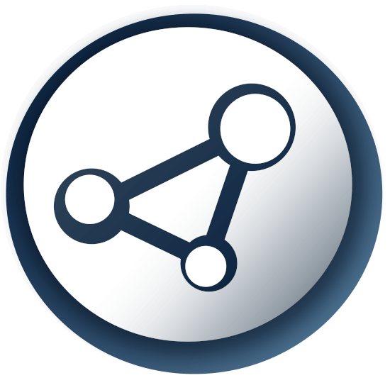
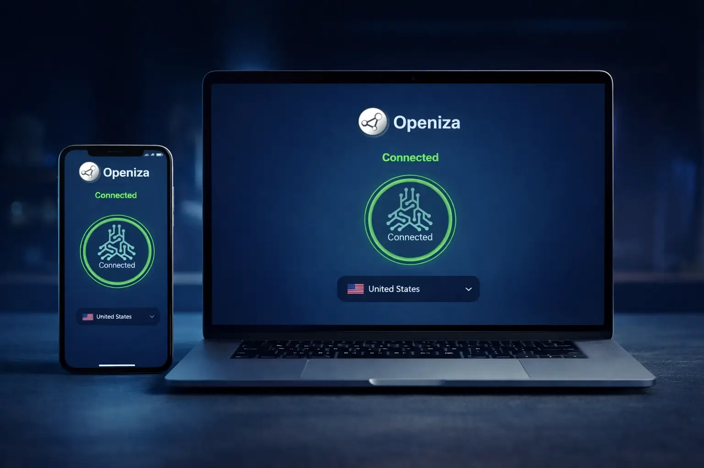

<!-- ========================================================= -->
<!--                         HERO SECTION                      -->
<!-- ========================================================= -->

   

  <!-- Replace with your real logo -->
  

  <h1>Openiza</h1>
  <h3>Open Censorship-Resistant Connectivity Infrastructure</h3>
  

    <strong>Open. Secure. Private. Resilient.</strong> 
    Infrastructure designed for high-censorship environments.
  

   

  <!-- Badges -->
  
  
  
  
  

    

  

---

## 📑 Table of Contents

- <a href="#vision">Vision</a>
- <a href="#project-status">Project Status</a>
- <a href="#problem">Problem</a>
- <a href="#solution-overview">Solution Overview</a>
- <a href="#architecture">Architecture (High-Level)</a>
- <a href="#roadmap">Roadmap</a>
- <a href="#principles">Principles</a>
- <a href="#threat-model">Threat Model</a>
- <a href="#donate">donate & Support</a>
- <a href="#security-notice">Security Notice</a>
- <a href="#contact">Contact</a>

---

<h2 id="vision">🌍 Vision</h2>

Openiza aims to build a long-term, censorship-resistant connectivity layer
that enables people in high-censorship environments to access the free internet
securely and privately — while minimizing exposure to surveillance and protocol detection.

The project begins with a focus on Iran and is designed with region-specific
threat modeling in mind.

  

  
---

<h2 id="project-status">🚧 Project Status</h2>

Openiza is currently in the <strong>early research and infrastructure design phase</strong>.

<ul>
  <li>Core architecture under development</li>
  <li>Threat model research ongoing</li>
  <li>Infrastructure funding required for development</li>
</ul>

---

<h2 id="problem">⚠️ Problem</h2>

Internet access in Iran is heavily restricted and monitored through advanced
state-level censorship systems, including:

<ul>
  <li>Deep Packet Inspection (DPI)</li>
  <li>Protocol fingerprinting</li>
  <li>Traffic correlation</li>
  <li>Active probing and blocking</li>
  <li>Server discovery and rapid blacklisting</li>
</ul>

Existing tools often suffer from rapid detection, centralized infrastructure,
or weak region-specific threat modeling.

---

<h2 id="solution-overview">🛠 Solution Overview</h2>

This project implements a phased, adaptive, and impact-driven approach to provide secure, censorship-resistant internet access for users in Iran.

<ul>
  <li>Immediate Access with Existing Tools and Protocols</li>
  <li>Phased Client Development Across Platforms</li>
  <li>Automated and Scalable Server Management</li>
  <li>Long-Term Research and Open Protocol Design</li>
  <li>User Safety and Privacy by Design</li>
</ul>

---

<h2 id="architecture">🧱 Architecture (High-Level)</h2>

⚠️ Sensitive implementation details are intentionally omitted.

<ul>
  <li>Modular server/client architecture</li>
  <li>Rapid node rotation capability</li>
  <li>Region-aware deployment strategy</li>
  <li>Fingerprint minimization techniques</li>
  <li>Open, auditable core components (planned)</li>
</ul>

---

<h2 id="roadmap">🗺 Roadmap</h2>

Openiza follows a phased development strategy:

<ul>
  <li><strong>Phase 1:</strong> Core server/client architecture + real-world resilience testing</li>
  <li><strong>Phase 2:</strong> Automated and scalable servers node lifecycle management</li>
  <li><strong>Phase 3:</strong> Native client support (including Apple platforms)</li>
  <li><strong>Phase 4:</strong> Research and development of a next-generation open protocol</li>
</ul>

The goal is not only circumvention — but sustainable infrastructure resilience.

---

<h2 id="principles">🔐 Principles</h2>

<ul>
  <li>Privacy and user safety by design</li>
  <li>Minimal long-term fingerprintability</li>
  <li>Infrastructure agility</li>
  <li>Open-source and auditable components</li>
  <li>Iran-specific threat modeling</li>
  <li>Security-first disclosure policy</li>
</ul>

---

<h2 id="threat-model">🧠 Threat Model</h2>

Openiza assumes:

<ul>
  <li>State-level adversaries with DPI capability</li>
  <li>Protocol fingerprinting and anomaly detection</li>
  <li>Active server discovery</li>
  <li>Traffic metadata analysis</li>
</ul>

Design decisions are made based on these assumptions.

---

<h2 id="donate">💸 Support / Donate</h2>

Openiza is currently seeking early-stage funding to:

<ul>
  <li>Expand server infrastructure</li>
  <li>Support research and protocol development</li>
  <li>Conduct resilience testing</li>
  <li>Enable independent security audits</li>
</ul>

If you want to support Openiza and help build censorship-resistant connectivity,
you can send donations to the following cryptocurrency wallets:

<table>
  <thead>
    <tr>
      <th>Network</th>
      <th align="left">Wallet Address</th>
    </tr>
  </thead>
  <tbody>
    <tr>
      <td>Bitcoin (BTC)</td>
      <td><code>bc1q2eaxha57ukan8ku0v3rvjqlkk9def2ja8x4qvf</code></td>
    </tr>
    <tr>
      <td>Ethereum (ETH)</td>
      <td><code>0xE5Ed0F833f8540082d808E1B01005d6E3EE047f8</code></td>
    </tr>
    <tr>
      <td>Solana (SOL)</td>
      <td><code>6a6ExrEcahiV3LHHF4RLC3U7Apf7wCHNaAf2Jxtg2fta</code></td>
    </tr>
    <tr>
      <td>Tron (TRX)</td>
      <td><code>TMAP9vktV2tSuxBcqs2bjyJzNWZubJ2aqy</code></td>
    </tr>
    <tr>
      <td>Monero (XMR)</td>
      <td><code>8BXHtXyafRKicQH1CQ8Td7etbXtNWgFR2H6brUNFeyS3S3rgk1HTP89C8j3R49yu6PEhUoEEoz5emSkd1X9DHp1J68D8Um4</code></td>
    </tr>
    <tr>
      <td>Lightning Network (BTC)</td>
      <td><code>lno1pgqppmsrse80qf0aara4slvcjxrvu6j2rp5ftmjy4yntlsmsutpkvkt6878s85luvzda00v79fqj0dl06fut74gupd8s4t80c9zax9x37ff025fvqgpdek6hch3qfexre4k4kn9n9lfp8umkp84x3u3zlx9vwsrx7ntce5cqxw54al03mh7ul52glq9n7um4m03h3j4mll7scq3ucr3frr833yvta7nrzhj4typf6txh2g63hp5ju43tvycs8566txr2nd7eawedmfsl0zpvenwzyz6jnuszrsvrjypr4knn5z42qqe2eltv7ufpctyy4umj83wal7t077egc4746vkht9kc43wuftj2s38cu8znccms54kmcnkvcdezkjrza99s</code></td>
    </tr>
  </tbody>
</table>

 

Thank you for supporting privacy, freedom, and secure connectivity! 🙏

------------------

<h2 id="security-notice">⚠️ Security Notice</h2>

No production infrastructure details, deployment topology,
or sensitive implementation data are published in this repository.

Operational security takes priority over public transparency
during early development.

---

<h2 id="contact">📬 Contact</h2>

For funding, research collaboration, or security inquiries:

📧 <a href="mailto:openiza.team@proton.me">openiza.team@proton.me</a>

🌐 <a href="https://openiza.com">openiza website</a>

---

   
  
  Openiza — Building resilient connectivity for restricted networks.
  
    

